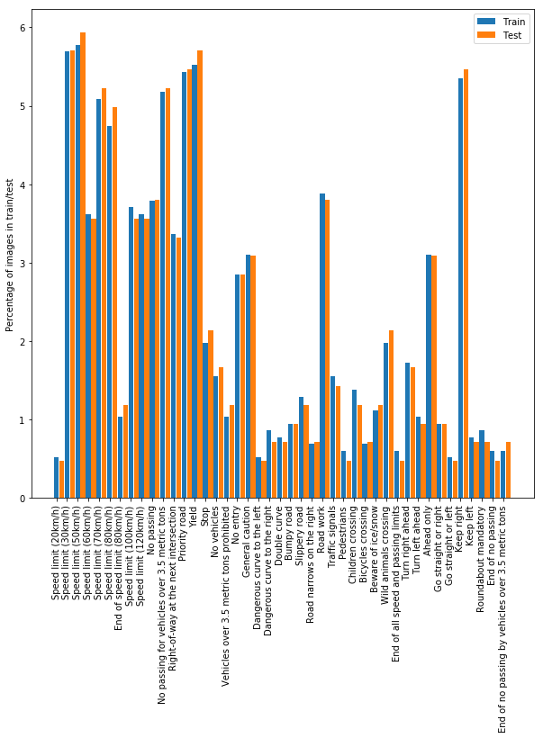
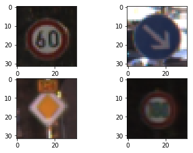
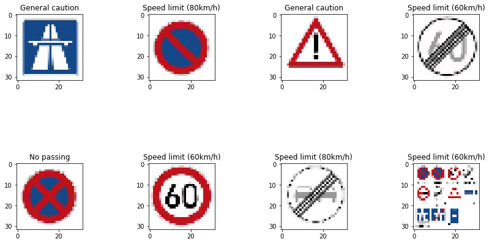

# **Traffic Sign Recognition** 

## Writeup

### You can use this file as a template for your writeup if you want to submit it as a markdown file, but feel free to use some other method and submit a pdf if you prefer.

---

**Build a Traffic Sign Recognition Project**

The goals / steps of this project are the following:
* Load the data set (see below for links to the project data set)
* Explore, summarize and visualize the data set
* Design, train and test a model architecture
* Use the model to make predictions on new images
* Analyze the softmax probabilities of the new images
* Summarize the results with a written report

[//]: # (Image References)

[image1]: ./examples/visualization.jpg "Visualization"
[image2]: ./examples/grayscale.jpg "Grayscaling"
[image3]: ./examples/random_noise.jpg "Random Noise"
[image4]: ./examples/placeholder.png "Traffic Sign 1"
[image5]: ./examples/placeholder.png "Traffic Sign 2"
[image6]: ./examples/placeholder.png "Traffic Sign 3"
[image7]: ./examples/placeholder.png "Traffic Sign 4"
[image8]: ./examples/placeholder.png "Traffic Sign 5"

## Rubric Points
### Here I will consider the [rubric points](https://review.udacity.com/#!/rubrics/481/view) individually and describe how I addressed each point in my implementation.  

---
### Writeup / README

#### 1. Provide a Writeup / README that includes all the rubric points and how you addressed each one. You can submit your writeup as markdown or pdf. You can use this template as a guide for writing the report. The submission includes the project code.

Here is a link to my [project code](https://github.com/mbreughe/CarND-TraficSign-P2). A frozen version of the notebook can be found here: https://htmlpreview.github.io/?https://github.com/mbreughe/CarND-TraficSign-P2/blob/master/Traffic_Sign_Classifier.html

### Data Set Summary & Exploration

#### 1. Provide a basic summary of the data set. In the code, the analysis should be done using python, numpy and/or pandas methods rather than hardcoding results manually.

I used the matplotlib and numpy to explore the dataset:

* The size of training set is ? 34799
* The size of the validation set is ? 4410
* The size of test set is ? 12630
* The shape of a traffic sign image is ? 32x32x3
* The number of unique classes/labels in the data set is ? 43 

#### 2. Include an exploratory visualization of the dataset.

Here is an exploratory visualization of the data set. It is a bar chart showing how many images we have of each kind as a percentage of the total images. This is done both for training and test data. We can see that we have a very similar distribution. However, some images are much better represented than others. 

Below we can see some example images:

### Design and Test a Model Architecture

#### 1. Describe how you preprocessed the image data. What techniques were chosen and why did you choose these techniques? Consider including images showing the output of each preprocessing technique. Pre-processing refers to techniques such as converting to grayscale, normalization, etc. (OPTIONAL: As described in the "Stand Out Suggestions" part of the rubric, if you generated additional data for training, describe why you decided to generate additional data, how you generated the data, and provide example images of the additional data. Then describe the characteristics of the augmented training set like number of images in the set, number of images for each class, etc.)

Contrary to the suggestion, I did not convert to grayscale. I believe the color channels contain valuable information. The European traffic sign system choose color next to using shapes to classify road signs. Since the goal of our neural network is to classify as well, my intuition is to use this extra information. Note: I did try grayscale in one of the initial attempts.

The only preprocessing I did was to normalize the image data. Various sources prove that data with zero mean is easier to handle.

I thought about augmenting existing images by rotating, adding noise, etc. I did not go this route as my prediction accuracy was already acceptable and augmenting it would distract me for several additional hours. If I were to do it, I would focus on signs we don't have a lot of examples for.

#### 2. Describe what your final model architecture looks like including model type, layers, layer sizes, connectivity, etc.) Consider including a diagram and/or table describing the final model.

My final model consisted of the following layers:

| Layer         		|     Description	        					| 
|:---------------------:|:---------------------------------------------:| 
| Input         		| 32x32x3 RGB image   							| 
| Convolution 5x5     	| 1x1 stride, valid padding, outputs 28x28x6 	|
| RELU					|												|
| Convolution 5x5	    | 1x1 stride, valid padding, outputs 24x24x16	|
| RELU					|												|
| Pooling  2x2 |  2x2 stride, outputs 12x12x16 |
| Flatten | Outputs 2304
| Fully connected		| Outputs 400        									|
| RELU  |  |
| Dropout 0.5 |  |
| Fully connected		| Outputs 120        									|
| RELU  |  |
| Fully connected		| Outputs 43        									|
| Softmax |  |

#### 3. Describe how you trained your model. The discussion can include the type of optimizer, the batch size, number of epochs and any hyperparameters such as learning rate.

To train the model, I used an Adam optimizer with start learning rate 0.001. I used a little over 10 EPOCH's (I saved the model after 10 and then run for another 2 or so). The batch size for stochastic descent was 128.

#### 4. Describe the approach taken for finding a solution and getting the validation set accuracy to be at least 0.93. Include in the discussion the results on the training, validation and test sets and where in the code these were calculated. Your approach may have been an iterative process, in which case, outline the steps you took to get to the final solution and why you chose those steps. Perhaps your solution involved an already well known implementation or architecture. In this case, discuss why you think the architecture is suitable for the current problem.

* I started off with plain grayscale LeNet as used in the lab. This gave a validation accuracy of 0.92.
* Adding the color channels did not drastically change validation accuracy. (Train Accuracy = 0.995; Validation Accuracy = 0.915). Though, I believe we could be throwing away information through the first maxpooling layer: we start of with more data than in the grayscale case, but we are reducing to the same amount of information after the first maxpooling layer.
* Next I removed this first maxpooling layer. This seems to result in slight overfitting (based on the increasing train accuracy and decreasing validation accuracy)
* In an additional step to retain information, I increased the size of the first FC layer next (to 400 nodes instead of 120). This resulted in a train accuracy of 0.998 and validation of 0.922.
* I added dropout to further reduce overfitting and was able to get Train Accuracy = 0.992; Validation Accuracy = 0.943.
* I ran into the common issue of not removing dropout when inferencing. This caused several issues, including undeterministic behavior in predictions. By fixing this bug I got a validation accuracy of 0.959.

My final model results were:
* training set accuracy of 0.999
* validation set accuracy of 0.959
* test set accuracy of 0.949

### Test a Model on New Images

#### 1. Choose five German traffic signs found on the web and provide them in the report. For each image, discuss what quality or qualities might be difficult to classify.

Below are the new images I downloaded, along with their predictions. Out of the 8 images, only 3 are actually have labels that we trained on (General Caution, Speed limit 60 and End no passing zone). The others are not present, though it is interesting to see what the network would predict.

Some thoughts: 
* First, it is sad that "End no passing zone" was not guessed correctly. Though I have only one sample to reason on, I guess the reason for this is that these images are "clean" images. Just like it is known with clipart, a network trained on real-world data does not function well on clipart and vice versa, the same seems to be true for this classifier. Whereas for humans this does not seem to be a problem, it throws the network off. 
* Second, I was hoping that the "End speed zone 60" (which is not present in the labels file) would be classified at least as "End speed zone 80". Unfortunately the network does not have this sort of intelligence. It does seem that it correctly saw "60" as it classified it as "Speed limit 60kph".

The first image might be difficult to classify because ...

#### 2. Discuss the model's predictions on these new traffic signs and compare the results to predicting on the test set. At a minimum, discuss what the predictions were, the accuracy on these new predictions, and compare the accuracy to the accuracy on the test set (OPTIONAL: Discuss the results in more detail as described in the "Stand Out Suggestions" part of the rubric).

Here are the results of the prediction:

| Image			        |     Prediction	        					| 
|:---------------------:|:---------------------------------------------:| 
| General Caution    			| General Caution 										|
| Speed Limit 60 km/h | Speed Limit 60 km/h|
| End no passing zone      		| Speed Limit 60 km/h   									| 

The model was able to correctly guess 2 of the 3 traffic signs, which gives an accuracy of 66%. Ideally I should include more images that actually are in the label set.

#### 3. Describe how certain the model is when predicting on each of the five new images by looking at the softmax probabilities for each prediction. Provide the top 5 softmax probabilities for each image along with the sign type of each probability. (OPTIONAL: as described in the "Stand Out Suggestions" part of the rubric, visualizations can also be provided such as bar charts)

This is the output:
[[ 0.13028832  0.13007034  0.08402088  0.07909174  0.07208278]
 [ 0.11634503  0.11243185  0.11062806  0.08838627  0.06729894]
 [ 0.11209257  0.10610474  0.09881061  0.08135346  0.0792448 ]
 [ 0.15466526  0.15152664  0.07842749  0.0655823   0.05611784]
 [ 0.12270123  0.10903735  0.10092885  0.09709264  0.06733111]
 [ 0.17620185  0.16230643  0.07277376  0.05651599  0.05189608]
 [ 0.15012276  0.14059651  0.08605058  0.06907868  0.05283676]
 [ 0.13799447  0.11644269  0.11122829  0.06988561  0.06225094]]
[['General caution' 'Speed limit (80km/h)' 'Speed limit (120km/h)'
  'No passing' 'Speed limit (60km/h)']
  
 ['Speed limit (80km/h)' 'Speed limit (60km/h)' 'No passing'
  'General caution' 'Speed limit (70km/h)']
  
 ['General caution' 'Speed limit (60km/h)' 'Speed limit (80km/h)'
  'Road work' 'No passing']
  
 ['Speed limit (60km/h)' 'Speed limit (80km/h)' 'No passing'
  'General caution' 'Road work']
  
 ['No passing' 'Speed limit (80km/h)' 'Speed limit (60km/h)'
  'General caution' 'Speed limit (70km/h)']
  
 ['Speed limit (60km/h)' 'Speed limit (80km/h)' 'No passing' 'Road work'
  'Dangerous curve to the left']
  
 ['Speed limit (80km/h)' 'Speed limit (60km/h)' 'No passing'
  'General caution' 'Road work']
  
 ['Speed limit (60km/h)' 'No passing' 'Speed limit (80km/h)'
  'General caution' 'Road work']]
  
  
For the three relevant images this means:
| Probability         	|     Prediction	        					| 
|:---------------------:|:---------------------------------------------:| 
| 0.112        			| *General caution*  									| 
| .106     				| Speed limit (60km/h) 										|
| .099					| Speed limit (80km/h)										|
| .081	      			| Road work				 				|
| .079				    | No passing      							|

| Probability         	|     Prediction	        					| 
|:---------------------:|:---------------------------------------------:| 
| 0.123       			| *Speed limit (60km/h)*  									| 
| .109     				| Speed limit (80km/h) 										|
| .101					| No passing										|
| .097	      			| Road work				 				|
| .067				    | Dangerous curve to the left      							|

| Probability         	|     Prediction	        					| 
|:---------------------:|:---------------------------------------------:| 
| 0.150       			| Speed limit (60km/h)  									| 
| .141     				| Speed limit (80km/h) 										|
| .086					| No passing										|
| .069	      			| General caution				 				|
| .053				    | Road work      							|

It seems like for the first two correct predictions, the network is not very sure which one to pick. The third prediction, which is incorrect, doesn't have the correct sign in its top 5.

### (Optional) Visualizing the Neural Network (See Step 4 of the Ipython notebook for more details)
#### 1. Discuss the visual output of your trained network's feature maps. What characteristics did the neural network use to make classifications?

